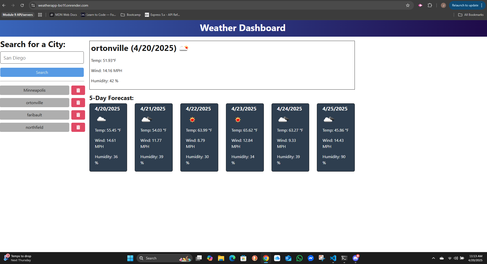

# Weather APP

## Description

Motivation for the project was to learn how to interacdt with API'S.  Why did I build the project? I saw it in a list of possible projects to do and I thought it would be an interesting one to do.  The problem that it solved was, it makes a convienent way of looking at a 5 day weather forcast for a city you want to know about, which could come in handy when preparing for a trip.  I learned tow to deploy an app on render and how to interact with an external api.

## Table of Contents

- [Installation](#installation)
- [License](#license)
- [Instructions](#instructions)
- [Links](#links)
- [Questions](#questions)

## Installation

Download the repository, then npm i to build the package-json and dependencies.  To run from a local machine at this point you would open a termainal in the repository folder and enter 
    npm run start:dev.  This will open a browser and the app will be there.

## License

This application is covered under the [The MIT License](https://opensource.org/licenses/MIT)

## Instructions

This app is very straight forward.  Upon opening in a browser there are three things that can be done.  Enter a city to get the weather for in the search box. Click on an existing city in the list of cities to get the weather forcast for that city. And finaly delete an item by clicking on its corresponding trash can.

Screen shot of application running:

## Links

[github repository](https://github.com/JeffC87/WeatherApp) 

[live web site on render](https://weatherapp-bo1f.onrender.com/)

## Questions

if you have any questions feel free to use the links below.

[GitHub](https://github.com/jeffc87)

[jlc68@me.com](mailto:jlc68@me.com)

